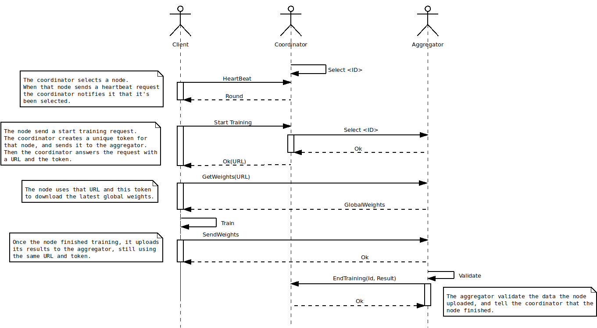
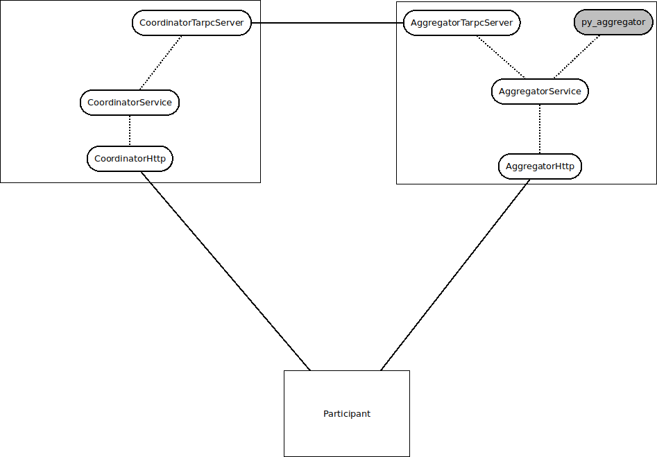

# Coordinator

This repo contains a proof of concept implementation of the
coordinator in Rust.

## Architecture

This aggregator handles very different types of requests than the
coordinator itself: weight distribution involves streaming high
volumes of data over the network, and aggregation involves periodic
CPU intensive tasks.

For these reasons, we're trying to make it a separate service that
communicates with the coordinator via a RPC. Here is how we envision
weights distribution with the aggregator service:

Here is a diagram of the various component and how they interact with
each other:

## Design choices (partially outdated)

### Asynchronous IO

The `CoordinatorService` runs on the tokio runtime, and requests are made through a `CoordinatorHandle`.

### Separation of IO and protocol logic

`crate::coordinator::protocol::Protocol` implements the protocol,
while `crate::coordinator::service::CoordinatorService` reacts to IO
events and update the `crate::coordinator::protocol::Protocol`
accordingly.

It turns out that this separation is not so clear in practice:

First, the `CoordinatorService` still has some protocol logic,
especially to handle `StartTraining` and `EndTraining`
requests. However, this could be simplified if the aggregator was a
separate service.

More importantly we have to keep information about the clients both at
the protocol level (eg whether the client has been selected) and the
IO level (eg timers). For consistency and memory efficiency reasons,
we preferred to keep that information in the same place:
`crate::coordinator::client::Clients`. As a consequence, some
information is duplicated: `Protocol` holds counters to keep track of
the number of participants in each state, while `Clients` already has
this information. This may be fixable though. We have to try
alternative designs.

### Memory

Client information is stored in only once place:
`crate::coordinator::client::Clients`. Since most of the time clients
are looked up by ID, we use hashmaps for storing the clients. Note
that we do sometimes need to iterate through the clients (for
selection for example) and iterating through big hashmaps can be an
issue.

### Modularity

We tried to identify logical units and keep them as separated as
possible. We currently have three main component: the coordinator
itself, the selector and the aggregator. Ideally the aggregator should
be taken out and implemented as a separate service, because its tasks
don't fit to well in our model (memory and CPU intensive tasks,
potentially blocking the event loop), and it does not need to share
much data with the coordinator (only the IDs of the clients that have
been selected)

### Separation of the API layer

Currently we external API. However implement one, whether it is ReST
or gRPC should not impact the protocol implementation. All that is
needed for such an external API is a `CoordinatorHandle`.
