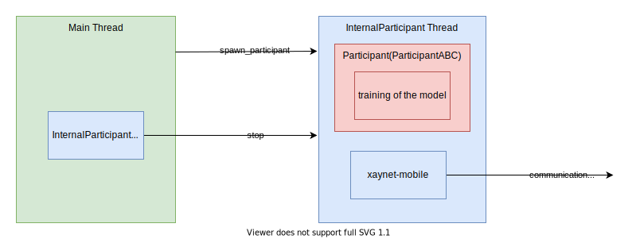
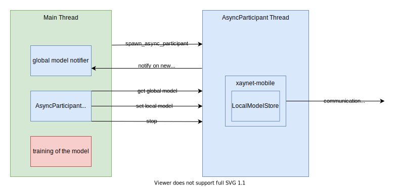

## Installation

**Prerequisites**

- Python (3.6 or higher)

**Install it from source**

```bash
# first install rust via https://rustup.rs/
curl --proto '=https' --tlsv1.2 -sSf https://sh.rustup.rs | sh

# clone the xaynet repository
git clone https://github.com/xaynetwork/xaynet.git
cd xaynet/bindings/python

# create and activate a virtual environment e.g.
pyenv virtualenv xayn
pyenv activate xayn

# install maturin
pip install maturin
pip install justbackoff

# install xaynet-sdk
maturin develop
```

## Participant API(s)

The Python SDK that consists of two experimental Xaynet participants `ParticipantABC`
and `AsyncParticipant`.

The word `Async` does not refer to either `asyncio` or asynchronous federated learning.
It refers to the property when a local model can be set. In `ParticipantABC`
the local model can only be set if the participant was selected an update participant
while in `AsyncParticipant` the model can be set at any time.

**Nice to know:**

The Python participants do not implement a Xaynet participant from scratch. Under the hood
they use [`xaynet-mobile`](../../rust/xaynet-mobile/) via
[`pyo3`](https://github.com/PyO3/pyo3).

### `ParticipantABC`

The `ParticipantABC` API is similar to the old one which we introduced in
[`v0.8.0`](https://github.com/xaynetwork/xaynet/blob/v0.8.0/python/sdk/xain_sdk/participant.py#L24).
The only difference is that the new participant now runs in its own thread and provides additional
helpful methods.



**Public API of `ParticipantABC`  and `InternalParticipant`**

```python
def spawn_participant(
    coordinator_url: str,
    participant,
    args: Tuple = (),
    kwargs: dict = {},
    state: Optional[List[int]] = None,
    scalar: float = 1.0,
):
    """
    Spawns a `InternalParticipant` in a separate thread and returns a participant handle.
    If a `state` is passed, this state is restored, otherwise a new `InternalParticipant`
    is created.

    Args:
        coordinator_url: The url of the coordinator.
        participant: A class that implements `ParticipantABC`.
        args: The args that get passed to the constructor of the `participant` class.
        kwargs: The kwargs that get passed to the constructor of the `participant` class.
        state: A serialized participant state. Defaults to `None`.
        scalar: The scalar used for masking. Defaults to `1.0`.

    Returns:
        The `InternalParticipant`.

    Raises:
        CryptoInit: If the initialization of the underling crypto library has failed.
        ParticipantInit: If the participant cannot be initialized. This is most
            likely caused by an invalid `coordinator_url`.
        ParticipantRestore: If the participant cannot be restored due to invalid
            serialized state. This exception can never be thrown if the `state` is `None`.
        Exception: Any exception that can be thrown during the instantiation of `participant`.
    """

class ParticipantABC(ABC):
    def train_round(self, training_input: Optional[TrainingInput]) -> TrainingResult:
        """
        Trains a model. `training_input` is the deserialized global model
        (see `deserialize_training_input`). If no global model exists
        (usually in the first round), `training_input` will be `None`.
        In this case the weights of the model should be initialized and returned.

        Args:
            self: The participant.
            training_input: The deserialized global model (weights of the global model) or None.

        Returns:
            The updated model weights (the local model).
        """

    def serialize_training_result(self, training_result: TrainingResult) -> list:
        """
        Serializes the `training_result` into a `list`. The data type of the
        elements must match the data type defined in the coordinator configuration.

        Args:
            self: The participant.
            training_result: The `TrainingResult` of `train_round`.

        Returns:
            The `training_result` as a `list`.
        """

    def deserialize_training_input(self, global_model: list) -> TrainingInput:
        """
        Deserializes the `global_model` from a `list` to the type of `TrainingInput`.
        The data type of the elements matches the data type defined in the coordinator
        configuration. If no global model exists (usually in the first round), the method will
        not be called by the `InternalParticipant`.

        Args:
            self: The participant.
            global_model: The global model.

        Returns:
            The `TrainingInput` for `train_round`.
        """

    def participate_in_update_task(self) -> bool:
        """
        A callback used by the `InternalParticipant` to determine whether the
        `train_round` method should be called. This callback is only called
        if the participant is selected as a update participant. If `participate_in_update_task`
        returns the `False`, `train_round` will not be called by the `InternalParticipant`.

        If the method is not overridden, it returns `True` by default.

        Returns:
            Whether the `train_round` method should be called when the participant
            is an update participant.
        """

    def on_new_global_model(self, global_model: Optional[TrainingInput]) -> None:
        """
        A callback that is called by the `InternalParticipant` once a new global model is
        available. If no global model exists (usually in the first round), `global_model` will
        be `None`. If a global model exists, `global_model` is already the deserialized
        global model. (See `deserialize_training_input`)

        If the method is not overridden, it does nothing by default.

        Args:
            self: The participant.
            global_model: The deserialized global model or `None`.
        """

    def on_stop(self) -> None:
        """
        A callback that is called by the `InternalParticipant` before the `InternalParticipant`
        thread is stopped.

        This callback can be used, for example, to show performance values ​​that have been
        collected in the participant over the course of the training rounds.

        If the method is not overridden, it does nothing by default.

        Args:
            self: The participant.
        """

class InternalParticipant:
    def stop(self) -> List[int]:
        """
        Stops the execution of the participant and returns its serialized state.
        The serialized state can be passed to the `spawn_participant` function
        to restore a participant.

        After calling `stop`, the participant is consumed. Every further method
        call on the handle of `InternalParticipant` leads to an `UninitializedParticipant`
        exception.

        Note:
            The serialized state contains unencrypted **private key(s)**. If used
            in production, it is important that the serialized state is securely saved.

        Returns:
            The serialized state of the participant.
        """
```

### `AsyncParticipant`

We noticed that the API of `ParticipantABC`/`InternalParticipant` reduces a fair amount of
code on the user side, however, it may not be flexible enough to cover some of the following
use cases:

1. The user wants to use the global/local model in a different thread.

    It is possible to provide methods for this on the `InternalParticipant` but they are not
    straight forward to implement. To make them thread-safe, it is probably necessary to use
    synchronization primitives but this would make the `InternalParticipant` more complicated.
    In addition, questions arise such as: Would the user want to be able to get
    the current local model at any time or would they like to be notified as soon as a new
    local model is available.

2. Train a model without the participant

    Since the training of the model is embedded in the `ParticipantABC`, this will probably lead to
    code duplication if the user wants to perform the training without the participant. Furthermore,
    the embedding of the training in the `ParticipantABC` can also be a problem once the participant
    is integrated into an existing application, considering the code for the training has to be
    moved into the `train_round` method, which can lead to significant changes to the existing code.

3. Custom exception handling

    Last but not least, the question arises how we can inform the user that an exception has been
    thrown. We do not want the participant to be terminated with every exception but we want to
    give the user the opportunity to respond appropriately.

The main issue we saw is that the participant is responsible for training the model
and to run the PET protocol. Therefore, we offer a second API in which the training
of the model is no longer part of the participant. This results in a simpler and more flexible API,
but it comes with the tradeoff that the user needs to perform the de/serialization of the
global/local on their side.



**Public API of `AsyncParticipant`**

```python
def spawn_async_participant(coordinator_url: str, state: Optional[List[int]]=None, scalar: float = 1.0)
    -> (AsyncParticipant, threading.Event):
    """
    Spawns a `AsyncParticipant` in a separate thread and returns a participant handle
    together with a global model notifier. If a `state` is passed, this state is restored,
    otherwise a new participant is created.

    The global model notifier sets the flag once a new global model is available.
    The flag is also set when the global model is `None` (usually in the first round).
    The flag is reset once the method `get_global_model` has been called but it is also possible
    to reset the flag manually by calling
    [`clear()`](https://docs.python.org/3/library/threading.html#threading.Event.clear).

    Args:
        coordinator_url: The url of the coordinator.
        state: A serialized participant state. Defaults to `None`.
        scalar: The scalar used for masking. Defaults to `1.0`.

    Returns:
        A tuple which consists of an `AsyncParticipant` and a global model notifier.

    Raises:
        CryptoInit: If the initialization of the underling crypto library has failed.
        ParticipantInit: If the participant cannot be initialized. This is most
            likely caused by an invalid `coordinator_url`.
        ParticipantRestore: If the participant cannot be restored due to invalid
            serialized state. This exception can never be thrown if the `state` is `None`.
    """

class AsyncParticipant:
    def get_global_model(self) -> Optional[list]:
        """
        Fetches the current global model. This method can be called at any time. If no global
        model exists (usually in the first round), the method returns `None`.

        Returns:
            The current global model or `None`. The data type of the elements matches the data
            type defined in the coordinator configuration.

        Raises:
            GlobalModelUnavailable: If the participant cannot connect to the coordinator to get
                the global model.
            GlobalModelDataTypeMisMatch: If the data type of the global model does not match
                the data type defined in the coordinator configuration.
        """

    def set_local_model(self, local_model: list):
        """
        Sets a local model. This method can be called at any time. Internally the
        participant first caches the local model. As soon as the participant is selected as the
        update participant, the currently cached local model is used. This means that the cache
        is empty after this operation.

        If a local model is already in the cache and `set_local_model` is called with a new local
        model, the current cached local model will be replaced by the new one.
        If the participant is an update participant and there is no local model in the cache,
        the participant waits until a local model is set or until a new round has been started.

        Args:
            local_model: The local model. The data type of the elements must match the data
            type defined in the coordinator configuration.

        Raises:
            LocalModelLengthMisMatch: If the length of the local model does not match the
                length defined in the coordinator configuration.
            LocalModelDataTypeMisMatch: If the data type of the local model does not match
                the data type defined in the coordinator configuration.
        """

    def stop(self) -> List[int]:
        """
        Stops the execution of the participant and returns its serialized state.
        The serialized state can be passed to the `spawn_async_participant` function
        to restore a participant.

        After calling `stop`, the participant is consumed. Every further method
        call on the handle of `AsyncParticipant` leads to an `UninitializedParticipant`
        exception.

        Note:
            The serialized state contains unencrypted **private key(s)**. If used
            in production, it is important that the serialized state is securely saved.

        Returns:
            The serialized state of the participant.
        """
```

## Enable logging of `xaynet-mobile`

If you are interested in what `xaynet-mobile` is doing under the hood,
you can turn on the logging via the environment variable `XAYNET_CLIENT`.

For example:

`XAYNET_CLIENT=info python examples/participate_in_update.py`

## How can I ... ?

We have created a few [examples](./examples/README.md) that show the basic methods in action.
But if something is missing, not very clear or not working properly, please let us know
by opening an issue.

We are happy to help and open to ideas or feedback :)
