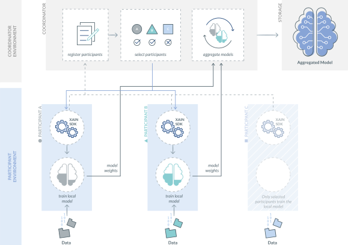
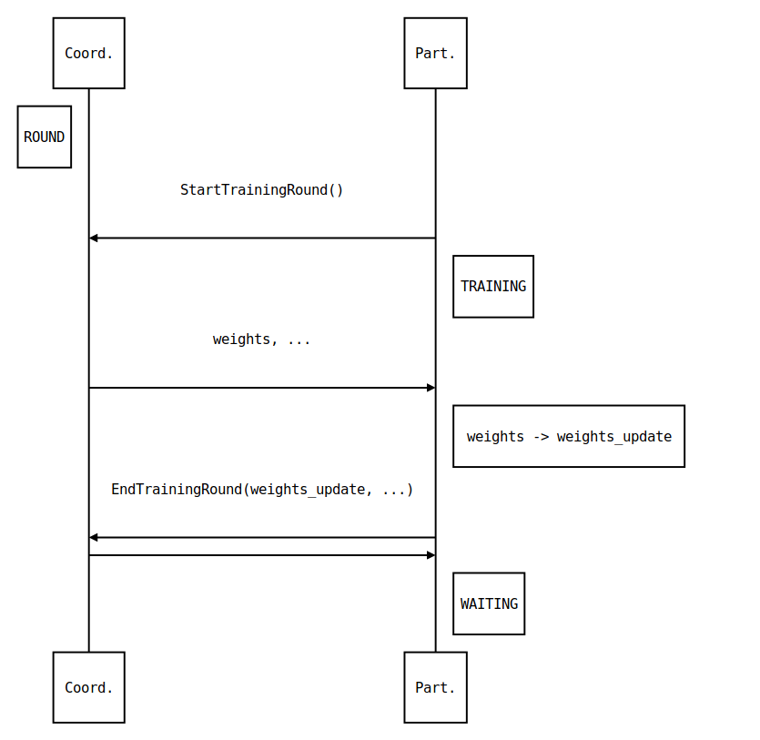

Network Architecture
====================

Introduction
------------



Federated Machine Learning is a distributed machine learning approach. In its
simplest form it is composed of one *Coordinator* and a set of *Participants*.

The **Coordinator** is responsible for keeping any state required for the machine
learning task, orchestrate the machine learning task across a set of
*Participants*, and perform the *Aggregation* of the individual updates
returned by the *Participants*.

The **Participants** are mostly stateless processes that receive from the
*Coordinator* a global model and the machine learning task to execute. Once
they finish executing the machine learning task they return
the updated model to the *Coordinator*.


Federated Machine Learning Flow
^^^^^^^^^^^^^^^^^^^^^^^^^^^^^^^

1. Instantiate a *Coordinator* with the task to execute the number of clients
   required and the number of rounds to perform (and any other relevant information)

.. code-block:: bash

    # warning: updated since time of writing - do not attempt to run!
    $ xain-coordinator fashion_mnist_100p_IID_balanced --clients=20 --rounds=50

2. Instantiate the *Participants* with the *Coordinator* address. If the *Coordinator* is
   not reachable just periodically try to reconnect.

.. code-block:: bash

    # warning: updated since time of writing - do not attempt to run!
    $ xain-client ec2-198-51-100-1.compute-1.amazonaws.com --port=5000

3. Rendezvous
4. Once all necessary *Participants* are connected, start a round:
    a. *Coordinator* sends global model
    b. *Participants* run the training
    c. *Participants* send the updates (and any other relevant information)
5. *Coordinator* completes a round:
    a. Wait for all *Participants* updates
    b. Run the *Aggregation* on the individual updates
    c. Repeat 4 and 5
6. If any *Participant* gets disconnected during a round:
    a. Wait for new *Participants* to come back online until the necessary number of clients is met
    b. Resume the task
7. Once all rounds are completed the *Coordinator* can just exit


Coordinator
-----------

This section discusses the design and implementation details of the
*Coordinator*.

**Requirements and Assumptions:**

* We need a bi-direction communication channel between *Participants* and *Coordinator*.
* There is no need for *Participant* to *Pariticipant* communication.
* The *Pariticipants* run on the client infrastructure. They should have low operation overhead.
* We need to be agnostic of the machine learning framework used by the clients.
* Keep in mind that the *Coordinator* may need to handle a large number of *Participants*.

**Features that need to be provided by the Coordinator:**

* Ability for *Participants* to register with it.
* Ability for *Participants* to retrieve the global model.
* Ability for *Participants* to submit their updated model.
* Ability for the *Coordinator* to orchestrate the training.
* Ability to keep track of the liveness of *Participants*.

gRPC and Protobuf
^^^^^^^^^^^^^^^^^

For the networking implementation we are using gRPC and for the data
serialization we are using protobuf.

The *Coordinator* is implemented as a gRPC service and provides 3 main methods.

A **Rendezvous** method that allows *Participants* to register with a
*Coordinator*. When handling this call the *Coordinator* may create some state
about the *Participant* in order to keep track of what the *Participant* is
doing.

A **StartTrainingRound** method that allows *Participants* to get the current global
model as well as signaling their intent to participate in a given round.

An **EndTrainingRound** method that allows *Participants* to submit their updated
models after they finished their training task.


In order to remain agnostic to the machine learning framework *Participants*
and *Coordinator* exchange models in the form of numpy arrays. How models are
converted from a particular machine learning framework model into numpy arrays
are outside the scope of this document. We do provide the `xain-proto
<https://github.com/xainag/xain-proto>`_ python package that performs
serialization and deserialization of numpy arrays into and from protobuf.


gRPC Implementation Challenges
^^^^^^^^^^^^^^^^^^^^^^^^^^^^^^

**1. Keeping track of Participant liveness**

The coordinator is responsible for keeping track of its connected participants
that may be performing long running tasks.  In order to do that the coordinator
needs to be capable to detect when a client gets disconnected. This does not
seem to be easy to achieve with gRPC (at least not with the Python
implementation).

From a developers perspective gRPC behaves much like the request response
pattern of a REST service. The server doesn't typically care much about the
clients and doesn't keep state between calls. All calls are initiated by the
client and the server simply serves the request and forgets about the client.

This also means that there really isn't much support for long standing
connections. It's easy for a client to check the status of the connection to
the server but the opposite is not true.

gRPC does use mechanisms from the underlying HTTP and TCP transport layers but
these are internal details that aren't really exposed in the API. A developer
can override the default timeouts but it's not clear from the available
documentation the effect they have. For more information check `using gRPC in
production <https://cs.mcgill.ca/~mxia3/2019/02/23/Using-gRPC-in-Production/>`_.

*Server-side timeouts configuration:*

.. code-block:: python

    server = grpc.server(
        futures.ThreadPoolExecutor(max_workers=10),
        options=(
            ('grpc.keepalive_time_ms', 10000),
            # send keepalive ping every 10 second, default is 2 hours
            ('grpc.keepalive_timeout_ms', 5000),
            # keepalive ping time out after 5 seconds, default is 20 seoncds
            ('grpc.keepalive_permit_without_calls', True),
            # allow keepalive pings when there's no gRPC calls
            ('grpc.http2.max_pings_without_data', 0),
            # allow unlimited amount of keepalive pings without data
            ('grpc.http2.min_time_between_pings_ms', 10000),
            # allow grpc pings from client every 10 seconds
            ('grpc.http2.min_ping_interval_without_data_ms',  5000),
            # allow grpc pings from client without data every 5 seconds
        )
    )

*Client-side timeouts configuration:*

.. code-block:: python

    stub = Stub(
          'localhost:50051', :this_channel_is_insecure,
          channel_args: {
          'grpc.keepalive_time_ms': 10000,
            'grpc.keepalive_timeout_ms': 5000,
            'grpc.keepalive_permit_without_calls': true,
            'grpc.http2.max_pings_without_data': 0,
            'grpc.http2.min_time_between_pings_ms':10000,
            'grpc.http2.min_ping_interval_without_data_ms': 5000,
          }
      )

It's also not clear how connections are handled internally. At least in the
Python library when opening a channel no connection seems to be made to the
server. The connection only happens when a method is actually called.

With the provided APIs from the server side we can only do any logic from
within a method call.

From the python gRPC documentation there seems to be two ways that allow us to
keep track of client connections from the server side is to have the client
calling a method that never returns.  From within that method the server can
either:

*Add callback to get notified when an RPC call was terminated:*

.. code-block:: python

    def rpc_terminated_callback(context):
        # do something with the context

    def SomeMethod(self, request, context):
        context.add_callback(lambda: rpc_terminated_callback(context))

        # rest of the method logic

*Periodically check if the rpc call is active:*

.. code-block:: python

    def SomeMethod(self, request, context):
        while context.is_active():
            time.sleep(5)

        # if we reach this point the client terminated the call

The problem with these approaches is that we need to block the gRPC method call
in order to keep track of the connection status. There are two problems with
these long standing connections: we are wasting server resources to do nothing,
and we need to deal with the underlying gRPC connection timeouts as described
above.

Ultimately we decided to just implement ourselves a simple heartbeat solution.
The *Participants* periodically send a heartbeat to the *Coordinator*. If the
*Coordinator* doesn't hear from a *Participant* after a pre-defined timeout if
just considers the *Participant* to be down and removes the *Participant* from
it's participant list.

*Heartbeat:*

.. code-block:: python

    def Heartbeat(self, request, context):
        self.participants[context.peer()].expires = time.now() + KEEPALIVE_TIME
        return PingResponse()

    # in another thread periodically call/schedule
    def monitor_clients(self):
        for participant in self.participants:
            if participant.expires < time.now() + KEEPALIVE_TIMEOUT:
                # remove participant and perform any action necessary


**2. Requests need to be initiated by the Participants**

With gRPC since the *Coordinator* implements the gRPC server all calls need to
be initiated by the client. So we will need for the *Participant* to implement
some form of polling mechanisms to know when the *Coordinator* is ready to
start a round. Again the same solutions as the previous point can be applied.

One solution would be to block during a method call until the *Coordinator*
initiates a round.

The other solution that we eventually chose was to reuse the heartbeat
mechanism to notify the *Participants* on when to start training. During the
heartbeat messages the *Coordinator* advertises its state with the
*Participants*. When the *Participants* see that a new round has started they
can request the global model and start their training task.


Coordinator Logic Implementation
^^^^^^^^^^^^^^^^^^^^^^^^^^^^^^^^

Internally the *Coordinator* :math:`C` is implemented as a state machine that
reacts to messages sent by *Participants* :math:`P`.

Let's consider the basic lifecycle of state transitions in :math:`C`. Let
:math:`N` be the number of required participants.

.. mermaid::

    graph TB
    A( ) -->|startup| B(STANDBY)
    B -->|N registered| C(ROUND)
    C -->|dropout| B
    C -->|next round| C
    C -->|no more rounds| D(FINISHED)

Once :math:`C` starts up, it's in the **STANDBY** state and open for incoming
connections from participants looking to rendezvous. Once :math:`N` have been
registered, a number of these are selected for a training round. To simplify
for now, assume all :math:`N` will participate.

Starting from :math:`i=0`, in the **ROUND** :math:`i` state, :math:`C` starts to accept
requests (from the registered :math:`N`) to start training for the :math:`i` th
round. Any further requests from late entrants to rendezvous are told to "try
again later". For any :math:`P` that has started training, :math:`C` will also
accept a subsequent request of it having finished training. If there are
dropouts, :math:`C` goes back to **STANDBY** and only resumes **ROUND** :math:`i` once
registrations again reach :math:`N`.

Once all :math:`N` have finished training the :math:`i` th round, :math:`C`
collects together all the trained data and aggregates them, generating a new
global model. It either increments the round to :math:`i+1` and repeats, or if
there are no more rounds to go, it transitions to the **FINISHED** state
signaling the participants to disconnect.


Participant
-----------

Participants are the workhorses of the federated learning platform. One would
expect them to be spending a significant portion of their time computing trained
models. But what exactly should be communicated between Participant :math:`P`
and Coordinator :math:`C` in a training round?

It helps to look at the following (simplified) code excerpt from the
single-machine "prototype" :code:`fl/Coordinator`:

.. code-block:: python

    # note: code updated since time of writing but idea remains the same
    def train_local(p, weights, epochs, epoch_base):
        weights_update, history = p.train_round(weights, epochs, epoch_base)
        metrics = p.metrics()
        return weights_update, history, metrics

To do its training, :math:`P` will invoke its own :code:`train_round` function.
For this, it requires the following data (annotated with their types) from
:math:`C`

* :code:`weights: List[ndarray]`
* :code:`epochs: int`
* :code:`epoch_base: int`

In return :math:`P` sends back a pair of data

* :code:`weights_update: Tuple[List[ndarray], int]`
* :code:`history: Dict[str, List[float]]`

After a :code:`train_round`, :math:`C` also needs from :math:`P`
a :code:`metrics` of type :code:`Dict[str, ndarray]`.

.. note::

    It is worth bearing in mind that since we are working with gRPC, all service
    calls must be initiated by the client (as discussed above), i.e. :math:`P`. This
    is completely unlike the code excerpt above, where it is naturally :math:`C`
    that calls :math:`P`.

    Also since :math:`P` in addition sends metrics at the end of a round, this and
    the updated model can just as well be sent in the same message thus minimising
    communication.

Training Round Data Messages
^^^^^^^^^^^^^^^^^^^^^^^^^^^^

The above considerations lead to the following gRPC service definition for
exchanging training data. The Coordinator exposes two service methods

.. code-block:: proto

   rpc StartTrainingRound(StartTrainingRoundRequest) returns (StartTrainingRoundResponse) {}
   rpc EndTrainingRound(EndTrainingRoundRequest) returns (EndTrainingRoundResponse) {}

where the request and response data are given as the following protobuf messages:

.. code-block:: proto

   message StartTrainingRoundRequest {}

   message StartTrainingRoundResponse {
       repeated xain_proto.numproto.NDArray weights = 1;
       int32 epochs = 2;
       int32 epoch_base = 3;
   }

   message EndTrainingRoundRequest {
       repeated xain_proto.numproto.NDArray weights = 1;
       int32 number_samples = 2;
       map<string, xain_proto.numproto.NDArray> metrics = 3;
   }

   message EndTrainingRoundResponse {}


Note that while most of the Python data types to be exchanged can be
"protobuf-erized" (and back), :code:`ndarray` requires more work. Fortunately we
have the 
`xain_proto/numproto <https://github.com/xainag/xain-proto/tree/master/python/xain_proto/numproto>`_
project to help with this conversion.

Training Round Communication
^^^^^^^^^^^^^^^^^^^^^^^^^^^^

The communication is summarised in the following sequence diagram.
In a training round, :math:`C` is in the state :code:`ROUND`. The selected
participant :math:`P` is in the :code:`TRAINING` state (see state diagram later). The first message by
:math:`P` essentially kicks off the exchange. :math:`C` responds with the global
model :code:`weights` (and other data as specified in
:code:`StartTrainingRoundResponse`). Then :math:`P` carries out the training locally.
When complete, it sends the updated model :code:`weights_update` (and other metadata)
back. :math:`C` responds with an acknowledgement.



..
    this comment is just here to keep the original markdown code of the above sequence diagram!
    ```sequence
    participant Coord. as C
    participant Part. as P
    Note left of C: ROUND
    P->C: StartTrainingRound()
    Note right of P: TRAINING
    C->P: weights, ...
    Note right of P: weights -> weights_update
    P->C: EndTrainingRound(weights_update, ...)
    C->P:
    Note right of P: WAITING
    ```

**Participant Notification via Extended Heartbeat**

In the above, how did :math:`P` detect the state change in :math:`C` to
:code:`ROUND` given that there is no easy way for :math:`C` to send such
notifications? As mentioned above in the discussion on the Coordinator, the
heartbeat mechanism was extended for this purpose. Not only does it provide a
liveness check on Participants, but it also doubles as a way for them to be
"signalled" (with some variable delay) of state changes.

In more detail, :math:`C` now populates responses to heartbeats with either
:code:`ROUND` (training round in progress) or :code:`STANDBY` (not in progress) during a round.
In the former case, a round number is also emitted. When all rounds are over,
:math:`C` will respond with :code:`FINISHED`.


Participant State Evolution
^^^^^^^^^^^^^^^^^^^^^^^^^^^

The following is a description of the :math:`P` state machine. It focuses on
the state transitions in response to heartbeat messages described above, and is
also able to handle *selection*.

.. mermaid::

   graph TB
   A( ) -.->|rendezvous| B(WAITING i)
   B -->|STANDBY| B
   B -->|ROUND j>i| C(TRAINING j)
   C -.->|trained i := j| B
   B -->|FINISHED| D(DONE)

In the **WAITING** :math:`i` state, the idea is that :math:`P` has already
trained round :math:`i` locally and is waiting for selection by a :code:`ROUND`
:math:`j` heartbeat for :math:`j>i`. At this point, it transitions to
**TRAINING** :math:`j`. At the start, we initialise :math:`i=-1`.

In **TRAINING** :math:`j`, the idea is that local training for round :math:`j`
is in progress. Specifically, :math:`P` carries out the above communication
sequence of messages with :math:`C`:

* :code:`StartTrainingRound` :math:`\rightarrow` :code:`weights`
  :math:`\rightarrow` :code:`weights_update` :math:`\rightarrow`
  :code:`EndTrainingRound`

Having received the :code:`EndTrainingRound` response from :math:`C` signifying
the completion of this local round of training, :math:`P` makes an "internal"
transition to **WAITING** :math:`j`.

If :code:`FINISHED` is observed while **WAITING**, it moves to **DONE**.
