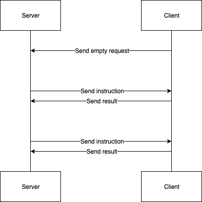

# Network Module

This module encapsulates the networking logic required for the training on multiple machines. It provides a context manager for the client and a client manager, client manager factory as well as a ClientProxy abstract base class for the server side.

## client.connection (Context Manager)

Provides a connection context while returning a tuple of two with two methods named `consume()` and `dispatch(proto_message)`.

- **consume():** Returns a server side instruction
- **dispatch(proto_message):** Takes a proto message which is send as a response to the server

```python

    with client.connection() as c:
        consume, dispatch = c

        # Passing initiative to server with an empty init message
        dispatch(stream_pb2.ClientMessage())

        while True:
            # Get next instruction
            instruction = consume()

            # Do something now...
            results = do_something()

            # Dispatch the results
            dispatch(results)
```

## ClientProxy
ClientProxy is a abstract base class which exposes a method called `run(proto_message)` and is the recommended way of implementing the server side client proxy.

Usage example:
```python
class Participant(ClientProxy):
    """Holds request until its anwered"""
    def train(self, theta):
        instruction = stream_pb2.ServerMessage()
        response_from_client_as_pb_message = self.run(instruction)
        return response_from_client_as_pb_message
```

## ClientManagerServicer

ClientManagerServicer is the gRPC servicer which will be added to the gRPC server as when calling the `server.create_client_manager()` function and returned. It exposes only one relevant method `client_manager.get_clients(min_num_clients: int)` which will block until it can return the minimum number of clients requested. It can be used as in the following example

```python
    def client_factory():
        client_instance = Client()
        return client_instance

    _server, client_manager = create_client_manager(
        client_proxy_factory=client_factory
    )
```

## Communication (request/response model)

Technically each instruction send by the server is a response to the previous client request. Partically we are holding each client request on the serverside until we have a new instruction to be send.
We initialize the flow with an empty client request send to the server.


